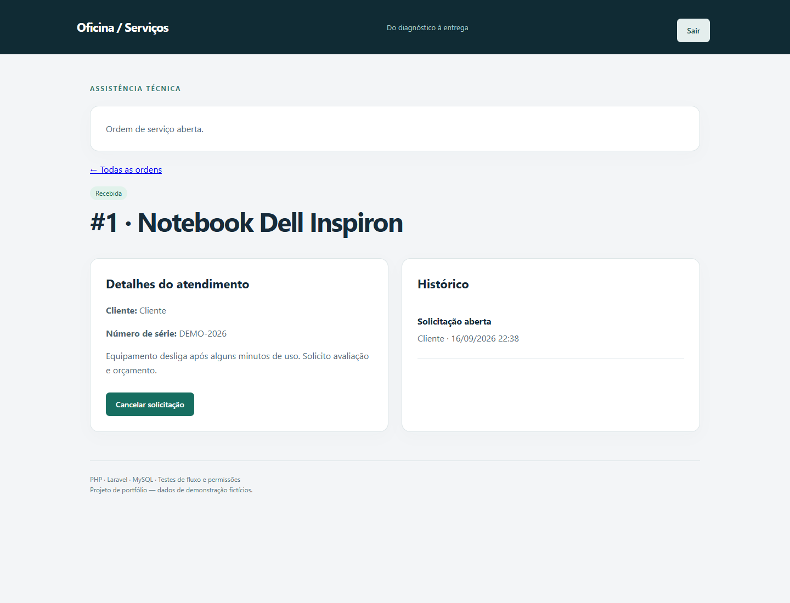
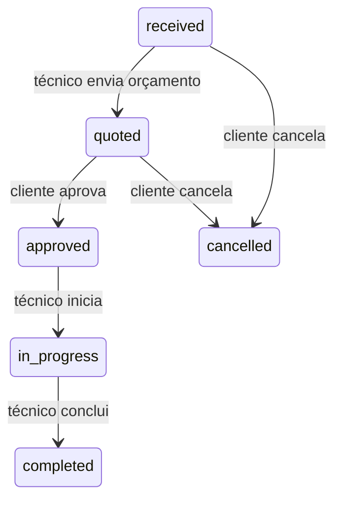

# Oficina · Ordens de serviço

[](https://github.com/fbottega-dev/ordens-servico-laravel/actions/workflows/ci.yml)

Aplicação de assistência técnica: o cliente solicita atendimento, o técnico envia um orçamento e o serviço só começa depois da aprovação do proprietário. Cada mudança fica no histórico.

**Stack:** PHP 8.4 · Laravel 13 · Blade · Eloquent · MySQL · PHPUnit · Docker.



## Funcionalidades

- Cadastro, login e logout com sessão, CSRF e limite de tentativas nas rotas de acesso.
- Clientes consultam apenas suas próprias ordens; técnicos consultam a fila.
- Equipamento, número de série opcional, descrição, diagnóstico e orçamento em centavos.
- Aprovação pelo cliente; início e conclusão pelo técnico.
- Cancelamento pelo cliente antes da aprovação; transições inválidas são recusadas.
- Histórico com usuário, ação e data; filtros e paginação.

## Executar localmente

Requisitos: PHP **8.4**, Composer 2 e extensões mbstring, fileinfo, openssl, pdo_sqlite (ou pdo_mysql). O lockfile desta entrega foi validado em PHP 8.4. Não precisa de Node.

```bash
composer install
cp .env.example .env
php artisan key:generate
php -r "file_exists('database/database.sqlite') || touch('database/database.sqlite');"
php artisan migrate --seed
php artisan serve --port=8083
```

No PowerShell, substitua cp por `Copy-Item .env.example .env`. Abra **http://localhost:8083**. O padrão local utiliza SQLite persistente; MySQL está disponível no Compose.

| Conta de demonstração | Senha | Perfil |
|---|---|---|
| cliente@example.test | Demo12345! | Cliente |
| tecnico@example.test | Demo12345! | Técnico |

O seeder cria essas contas somente com APP_ENV=local ou testing. Não execute esse seeder em uma instalação pública.

## Executar com MySQL e Docker

1. Copie .env.example para .env e configure DB_PASSWORD com um valor local.
2. Gere APP_KEY com `php artisan key:generate`. Se não tiver PHP local, use `docker run --rm php:8.4-cli php -r "echo 'base64:'.base64_encode(random_bytes(32));"` e copie a saída para APP_KEY no .env.
3. Execute:

```bash
docker compose up --build -d
docker compose exec app php artisan migrate --force
docker compose exec app php artisan db:seed --force
```

Abra http://localhost:8083. O Compose usa MySQL 8.4, banco isolado e porta publicada apenas no computador local. O servidor PHP embutido é destinado a demonstração.

## Testes

```bash
php artisan test
vendor/bin/pint --test
composer audit
```

No Windows, use `php vendor/bin/pint --test`. São 7 testes com 41 asserções: acesso anônimo, isolamento entre clientes, proteção de perfil, validação, transições e histórico. O Actions também verifica migrations e inicialização HTTP com MySQL no Docker.

## Fluxo



OrderWorkflow centraliza as regras em uma transação e bloqueia a ordem durante a mudança. ServiceOrderPolicy controla leitura. O servidor define proprietário e perfil; campos enviados pelo navegador não podem promovê-los. Valores monetários são inteiros em centavos, evitando arredondamentos de ponto flutuante.

## Rotas principais

| Método | Rota | Uso |
|---|---|---|
| GET / POST | /login | Tela / autenticação |
| POST | /register | Cadastro de cliente |
| POST | /logout | Encerrar sessão |
| GET / POST | /orders | Listagem / abertura |
| GET | /orders/{id} | Detalhe e histórico |
| POST | /orders/{id}/transition | quote, approve, start, complete, cancel |

As rotas usam formulários Blade e sessão; este projeto não oferece uma API REST pública.

## Limitações e próximos passos

- Sem pagamentos, anexos, e-mail, recuperação de senha ou agendamento.
- Horários do histórico armazenados/exibidos em UTC nesta versão.
- Orçamento é enviado uma única vez; revisão de orçamento exige uma próxima regra de negócio.
- IA não está integrada ao atendimento nesta versão. Uma evolução possível é sugerir resumo/categoria para revisão humana, sem executar mudanças automaticamente.
- Antes de hospedagem pública: APP_ENV=production, APP_DEBUG=false, HTTPS, cookie Secure e servidor web apropriado.

[Uso de IA e revisão](docs/AI_USAGE.md) · [Próximas entregas](docs/ROADMAP.md)
